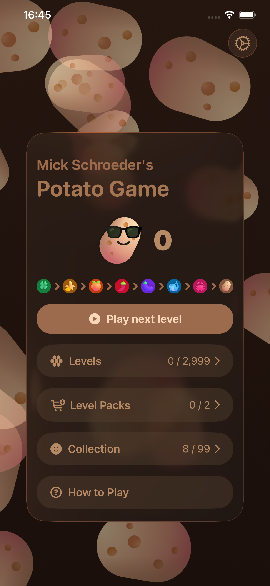
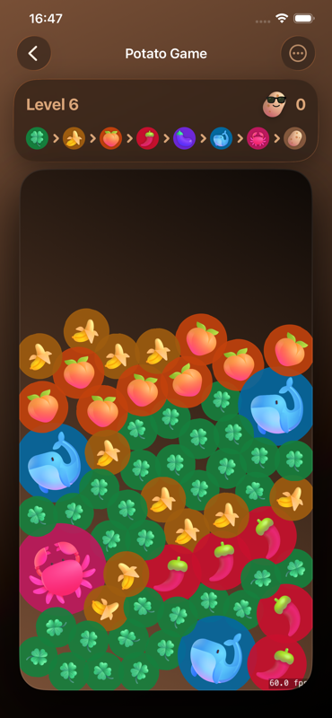
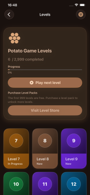
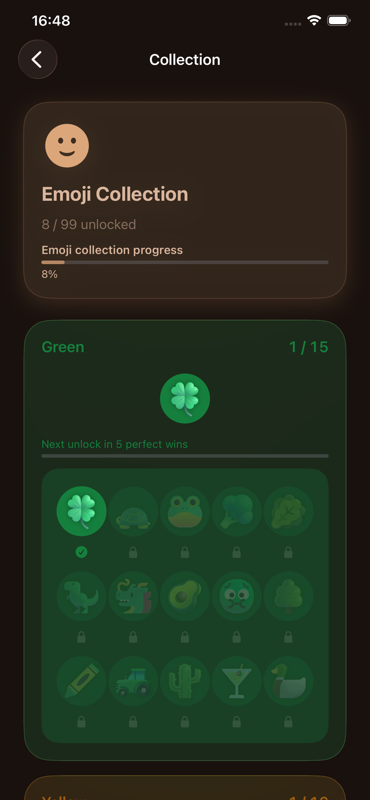

# Potato Game

Potato Game is a gravity based emoji merging puzzle for iOS and macOS. Tilt the board to slide emojis, tap matching clusters to evolve them, and keep merging until you create a potato. Play 1,000 free puzzles, and chase perfect clears to earn progress toward unlocking more emojis.

---

## Screenshots

## Install

- Download on iOS: [App Store](https://apps.apple.com/us/app/potato-game/id6477922776)  
- Download on macOS: [App Store](https://apps.apple.com/us/app/potato-game/id6477922776?platform=mac)

## Website

[Potato Game Landing Page](https://potatogame.mickschroeder.com)

## Author

[Mick Schroeder](https://mickschroeder.com)  

## Licensing & Credits

This is the open source code underlying Potato Game. The branded content and assets are not included.

- Core game source code © 2025 Mick Schroeder, LLC. — [MIT License](./LICENSE)  
- Original copy, localisations, art/audio assets, level templates, and branding elements (except where noted below) — [CC BY-NC 4.0](https://creativecommons.org/licenses/by-nc/4.0/)  
- “Potato Game” name and logo are trademarks of Mick Schroeder, LLC.  
- [Fluent Emoji](https://github.com/microsoft/fluentui-emoji) © Microsoft — MIT  
- [Mixkit Sound Effects](https://mixkit.co) — Mixkit Free Sound Effects used in this project.

See `ASSET_LICENSE.md` for full attribution and permitted uses.

## Trademark Notice

“Potato Game”, the Potato Game logo, and related marks are trademarks of Mick Schroeder, LLC.  
You may not use these names, logos, or identifying marks to distribute modified  
versions of this software or to publish derivative apps on the Apple App Store,  
Google Play, or other marketplaces without express written permission.

This repository’s source code is licensed under the MIT License (see LICENSE).
